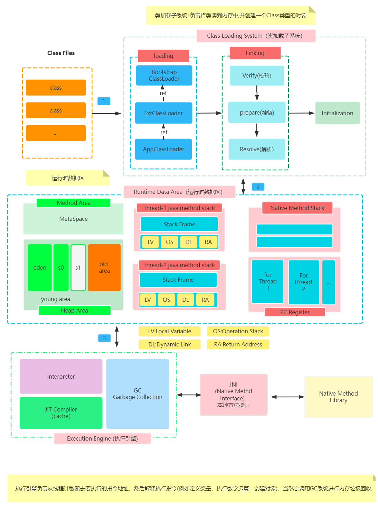

# JVM (JAVA虚拟机)

## 内容安排

* JVM体系结构
* JVM中的类加载子系统
* JVM中运行时内存区
* JVM中执行引擎(执行逻辑，GC逻辑)
* JVM中的字节码增强技术(拓展)

## JVM初识

* 为什么要学习JVM？

1. 为了面试 
2. 为了更好的理解JAVA
3. 为了更好的解决线上问题？(软件在线升级、防内存泄漏、提高吞吐量)
 
* 你了解哪些JVM产品？

1. Oracle公司的HotSpot。
2. IBM公司的J9
3. 阿里的TaobaoVM
4. .....

## JVM的体系结构

* JVM是什么？(一种虚拟机规范)
* JVM的构成有哪几部分？

1. 类加载子系统(负责将类读取到内存,校验类的合法性，对类进行初始化)
2. 运行时数据区(负责存储类信息，对象信息，以及执行计算的区域)
3. 执行引擎(负责从指定地址对应的内存中读取数据然后执行，同时还自带GC操作)
4. 本地库接口(负责Java语言与其它语言之间进行通讯)

* Hotspot虚拟机(JVM)的构成？

10:15 开始下节课

